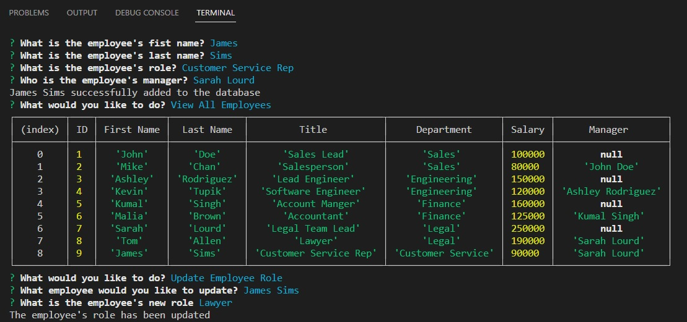

# Employee Tracker
 

## Description
This is a CLI application that allows a person to view information about their company. It allows them to view all of their departments, roles and employees. It  allows them to add a department, a role and an employee. It also has the ability to update an employee's role.

## Technologies Used
* Node.js
* MySQL2
* Inquirer
* SQL
* console.table
* dotenv

### Video Link
[https://drive.google.com/file/d/1j3VlrxQwN1GyZAkAhbHgZX307j2mWhon/view](https://drive.google.com/file/d/1j3VlrxQwN1GyZAkAhbHgZX307j2mWhon/view)

### Created by
Angel Van de Feniks
